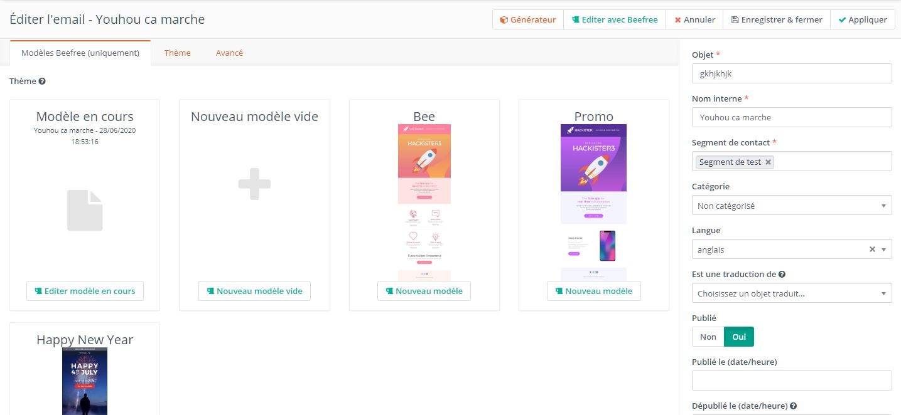

# BeeFree integration for Mautic

This is an experimental BeeFree integration for Mautic
- 06/28/2020 alpha1 release

### Installation from command line
1. composer require enguerr/MauticBeefreeBundle
2. php app/console mautic:plugins:reload
3. Go to /s/plugins and enable BeeFree integration
4. Go to https://beefree.io, create an account and an application. Get API_KEY et API_SECRET
5. Fill in the field API_KEY and API_SECRET - Save
6. php app/console cache:clear --env=dev
7. php app/console doctrine:schema:update --force

### Usage
Just go to email create new/edit and click to Launch builder BEEFREE button. Should open new popup iframe with BeeFree plugin.
You can also select one of the template from Template tab.

### What is working
    - Launch Beefree builder with save and close button
    - Save button
    - Create new email 
    - Edit email
    - Save versions
    - Use template library
### Todo
    - Save as template
    - Import template
    - Restore version
    - Integration with landing pages 
    - Automatically download images from Beefree servers and replace links (template and html)
    - Integrate premium features
    - Integrate external storage
    
    
### Where to find Templates
Goto https://github.com/BEE-Plugin/BEE-FREE-templates
With phpmyadmin on table beefree-theme, add json / name / preview (blob as jpeg image)

