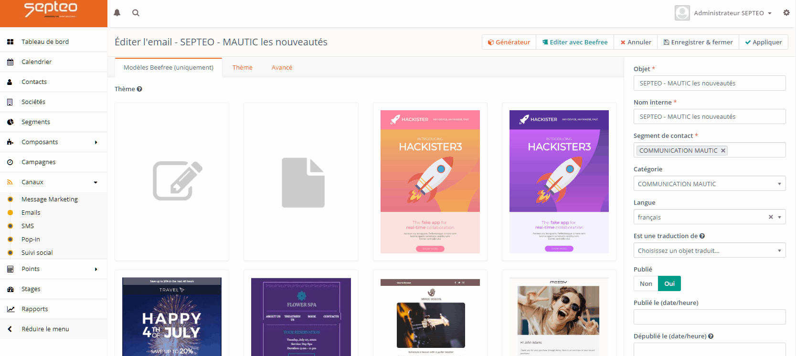

# BeeFree integration for Mautic

This is an experimental BeeFree integration for Mautic
- 06/28/2020 alpha0 release
- 06/30/2020 alpha1 release
- 07/10/2020 beta0 release

### Issues
- UTF-8 chars with js atob (resoved with unescape/URIDEcode workaround) - resolved
- Language support for beefree plugin - resolved

### Installation from command line
1. cd MAUTIC_DIR/plugins && git clone https://github.com/enguerr/MauticBeefreeBundle (or unzip the release)
2. app/console cache:clear --env=prod
3. app/console mautic:plugins:reload
4. Go to https://developers.beefree.io, create an account and an application. Get API_KEY et API_SECRET
5. Navigate to /s/plugins (Configuration > Plugins ) and enable BeeFree integration
6. Fill in the field API_KEY and API_SECRET in features tab && Save
7. app/console cache:clear --env=prod
8. php app/console doctrine:schema:update --force

### Usage
Just go to email create new/edit and click to Launch builder BEEFREE button. Should open new popup iframe with BeeFree plugin.
You can also select one of the template from Template tab.

### What is working
    - Launch Beefree builder with save and close button
    - Save button
    - Create new email 
    - Edit email
    - Save versions
    - Use template library
    - Email clone support
    - Integration with landing pages 
    - beefree user added to plugin configuration in order to limit files access through the media library
### Todo
    - Save as template
    - Automatically download images from Beefree servers and replace links (template and html)
    - Integrate premium features
    - Integrate external storage
    - Add mautic tokens support (form/dynamic content/unsubscribe_url etc ...)
    
    
### Where to find Templates
Goto https://github.com/BEE-Plugin/BEE-FREE-templates
With phpmyadmin on table beefree-theme, add json / name / preview (blob as jpeg image)

I've added an export of my theme table with 3 templates. 
You can edit the sql to fit your requirement (MAUTIC_PREFIX)
You can find it in the Sql Folder from the repo

